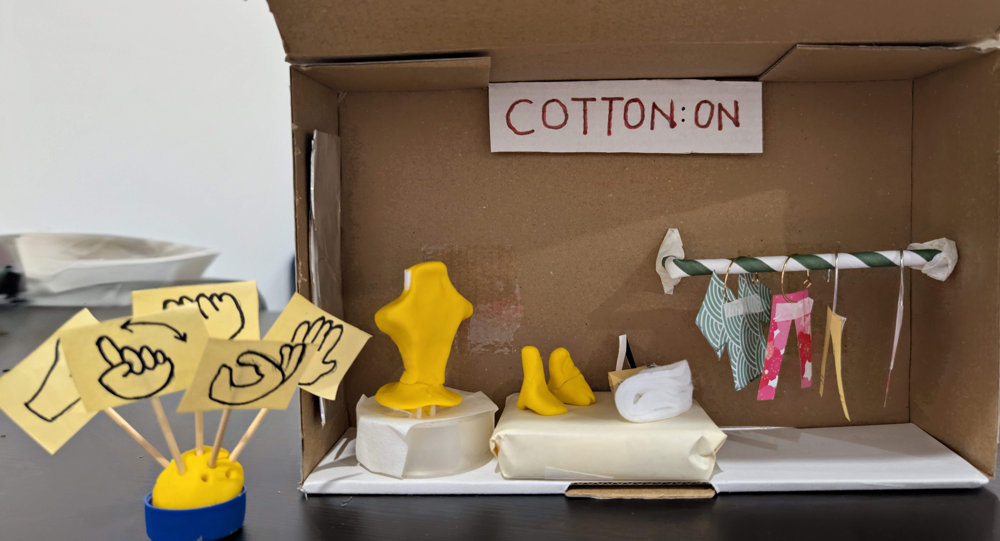

# Low Fidelity Protoype

This repository contains a low fidelity prototype demonstrating a gesture-based shopping experience for a virtual clothing store, inspired by **Cotton On**.  
The concept showcases how customers can interact with clothing racks, select accessories, try items on a virtual avatar, and proceed to checkout — all through intuitive movements.

---

## 📌 Overview

The prototype is split into two key parts:

1. **Instruction Board** – Shows the planned user interaction flow using sticky notes.
2. **Store Model** – A miniature representation of a retail store environment, complete with a clothing rack, mannequin avatar, and gesture indicators.

---

##  Prototype Details

### **Instruction Board**
The sticky notes represent the sequence of actions a user can take:

1. **Pull to get clothes from rack**  
2. **Get accessories to match**  
3. **Stop shopping → Checkout**  
4. **Added to Cart**  
5. **Putting clothes on your avatar**  
6. **Round motion for similar items**  

---

### **Physical Store Model**
The store model includes:
- **Cotton On branding sign**
- **Clothing rack** with miniature paper clothing items
- **Yellow mannequin avatar**
- **Accessory items** such as shoes
- **Gesture cards** illustrating hand movements (pull, rotate, swipe)

---

## User Flow
1. **Select clothing** 🫳 – Pull from the rack using gesture controls.
2. **Getting combination** 👌🏻 – Suggested items appear.
3. **Try-on**🤏 – Clothes are placed on the avatar.
4. **Add to cart** 👍 – Selected items go into a virtual cart.
5. **Checkout** ✋ – Finalizes purchase.
6. **Browse similar items**  – Rotational gesture brings up related products.

---

## 📷 Images
**Instruction Board:**  

**Store Model:**  

